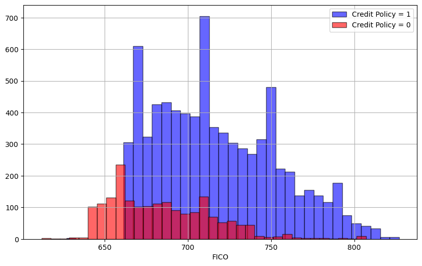
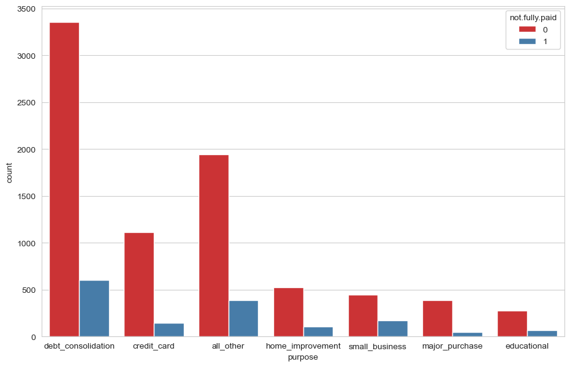
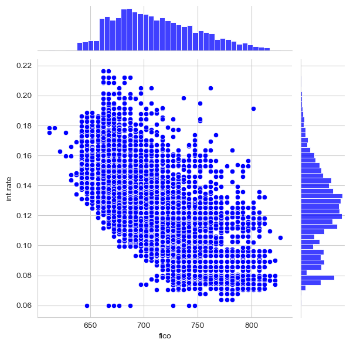

# 🌳 Decision Trees & 🌲 Random Forest Project

---

## 📌 Overview

This project applies **Decision Tree** and **Random Forest** algorithms to predict whether a borrower will fully repay a loan.

The goal is to help investors make informed lending decisions by analyzing borrower profiles and identifying repayment risk using machine learning models.

---

## 📂 Project Structure

```
Decision-Trees-Random-Forest/
│── data/                  # Dataset for training/testing
│── notebooks/             # Jupyter notebooks (step-by-step)
│── src/                   # Python scripts
│── results/               # Model outputs & metrics
│── visualizations/        # Plots and graphs
│── README.md              # Project documentation
│── requirements.txt       # Dependencies
```

---

## 📊 Dataset

* 🎯 **Target Variable:** `not.fully.paid`

  * `1` → Loan not fully paid
  * `0` → Loan fully paid

### 🔑 Key Features:

* `credit.policy` → Meets credit criteria or not
* `purpose` → Loan purpose
* `int.rate` → Interest rate
* `installment` → Monthly installment
* `fico` → Credit score
* `revol.util` → Credit utilization

---


## 🔍 Methodology

### 🧹 1. Data Preprocessing

* ✔ Handled missing values
* ✔ One-hot encoding for `purpose`
* ✔ Feature scaling
* ✔ Train-test split (80/20)

---

### 📈 2. Exploratory Data Analysis (EDA)

#### 🔹 FICO Distribution (credit.policy)



#### 🔹 Loan Distribution (not.fully.paid)




#### 🔹 FICO vs Interest Rate




## 🤖 Model Training

### 🌳 Decision Tree

* Built baseline model
* Easy to interpret
* Prone to overfitting

### 🌲 Random Forest

* Ensemble of decision trees
* Reduces overfitting
* Improves accuracy

---

## ⚙️ Hyperparameter Tuning

Used **GridSearchCV** to optimize:

* `n_estimators`
* `max_depth`
* `min_samples_split`

---

## 📝 Model Evaluation

### 📊 Metrics Used:

* Accuracy
* Precision
* Recall
* F1-score
* Confusion Matrix

---

### 🔹 Confusion Matrix

```
[[TN  FP]
 [FN  TP]]
```

## 📊 Results & Insights

* ✅ Random Forest outperformed Decision Tree
* ✅ Ensemble learning improved generalization
* ⚠️ Class imbalance slightly affected recall
* 📌 FICO score and interest rate are key predictors

---

## 🛠️ Technologies Used

* Python
* Scikit-learn
* Pandas & NumPy
* Matplotlib & Seaborn
* Jupyter Notebook

---


## ⭐ Support

If you like this project, give it a ⭐ on GitHub!


